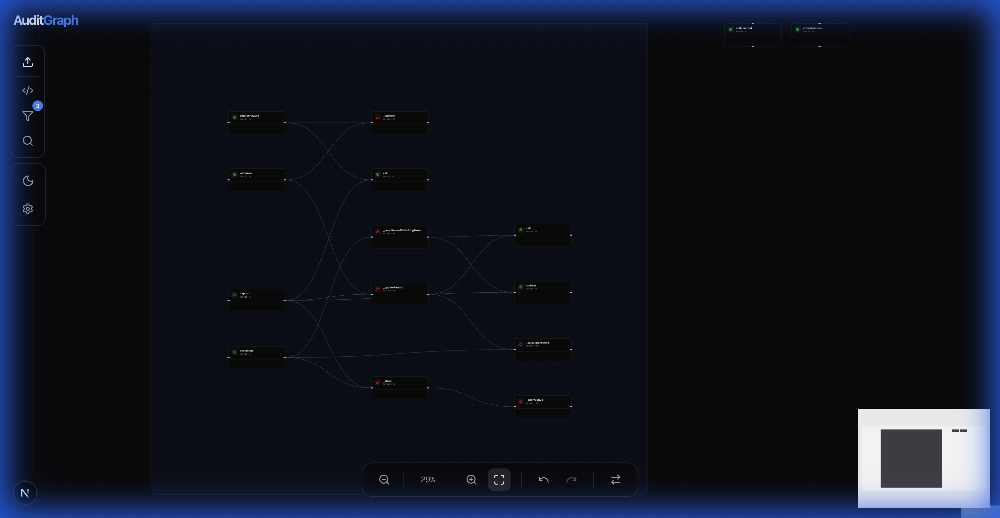
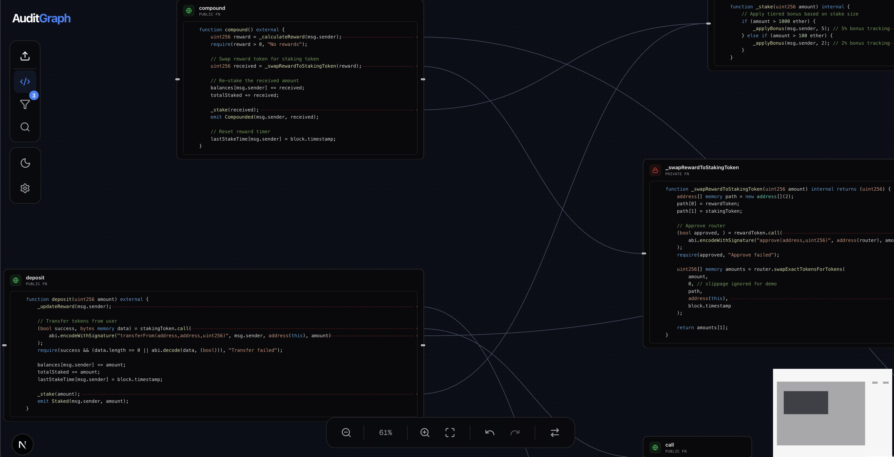
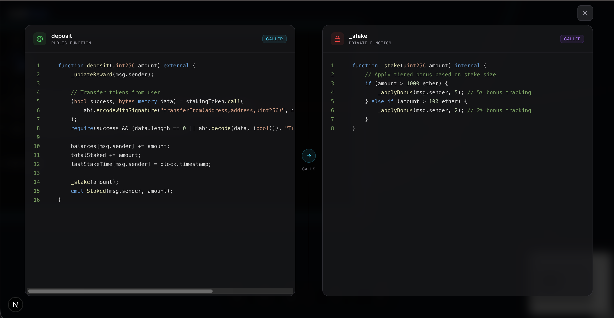
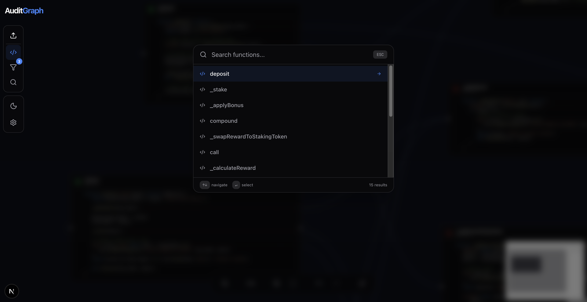

# AuditGraph

**Visualize Solidity Call Graphs & Logic Flows**

AuditGraph is a developer tool designed to help smart contract auditors and developers visualize complex Solidity projects. Upload your `.sol` files or a project `.zip`, and explore the function call graph with an interactive, node-based interface.



## Features

-   **Interactive Graph Visualization**: Automatically parses Solidity contracts and visualizes function calls as nodes and edges.
-   **Structure Awareness**: Groups functions by Contract, clearly distinguishing Interfaces vs. Implementations.
-   **Code View Overlay**: Click "Toggle Code View" to see the actual Solidity code inside each node, with precise call-site highlighting.
-   **Deep Search**: Press `Cmd+K` / `Ctrl+K` to instantly search and jump to any contract or function.
-   **Trace Highlighting**: Click any edge to highlight the entire call path (upstream and downstream dependencies).
-   **Filtering**: Toggle visibility of specific contracts or hide interfaces to reduce noise.
-   **Dark/Light Mode**: Fully themable UI.







## Getting Started

### Prerequisites

-   Node.js 18+
-   `npm` or `pnpm`

### Installation

1.  Clone the repository:
    ```bash
    git clone https://github.com/az0mb13/auditgraph.git
    cd auditgraph
    ```

2.  Install dependencies:
    ```bash
    npm install
    # or
    pnpm install
    ```

3.  Start the development server:
    ```bash
    npm run dev
    ```

4.  Open [http://localhost:3000](http://localhost:3000) in your browser.

## Usage

1.  **Upload**: Click the "Upload" button in the sidebar or drag & drop `.sol` files / `.zip` archives onto the canvas.
2.  **Explore**:
    -   **Pan/Zoom**: Use mouse wheel or trackpad.
    -   **Layout**: Switch between Left-Right (LR) and Top-Bottom (TB) layouts using the bottom toolbar.
    -   **Code View**: Toggle the `< >` icon to inspect source code directly on the graph.
3.  **Analyze**:
    -   Click an edge to see the exact line of code triggering the call.
    -   Use `Cmd+K` to find specific functions.

## Example

You can find a sample contract in `examples/SampleDeFi.sol` to test the visualization capabilities.

## Tech Stack

-   **Framework**: Next.js 14
-   **Visualization**: React Flow
-   **Layout Engine**: ELK.js
-   **Styling**: Tailwind CSS
-   **State Management**: Zustand + Zundo (Undo/Redo)
-   **Parser**: `solidity-parser-antlr`

---

Built with ❤️ for the Ethereum community.
